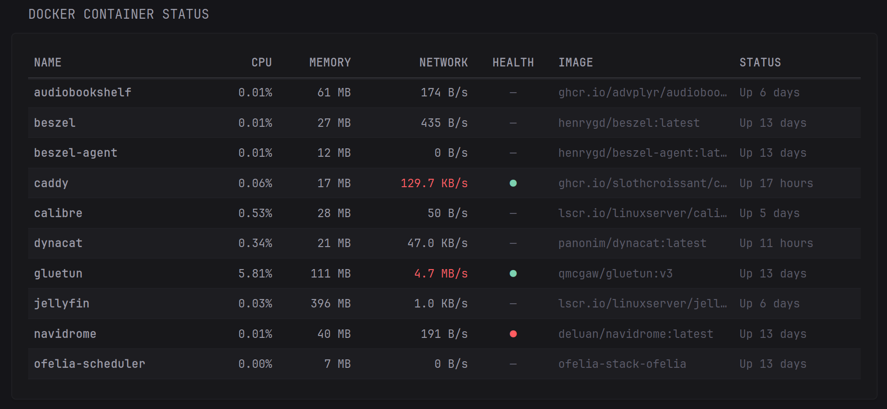

# Beszel Container Monitor

This widget provides an overview of your Docker containers' resource usage, uptime, and health indicators, pulled directly from your Beszel instance.

## Preview



## Configuration

```yaml
- type: dynawidgets
  widget: beszel-container-monitor
  title: Docker Container Status
  update-interval: 60s
  options:
    base-url: "${BESZEL_URL}"    
    api-token: "${BESZEL_API_TOKEN}" 
```

## Options

| Option       | Required | Description                                     | 
| ------------ | -------- | ----------------------------------------------- |
| `base-url`   | Yes      | URL of your Beszel instance. For example, `http://192.168.1.XX:8090`                   |
| `api-token`  | Yes      | Your Beszel token used for authentication.      |

<details>
<summary>How to Get Your Beszel API Token</summary>

---

Because Beszel uses PocketBase as its backend, you must generate a long-lived impersonation token from the admin panel to use as an API token.

### Step 1: Create a Read-Only User

1. **Access the Backend Panel:** Open your Beszel instance URL and append `/_/` to the end (e.g., `http://192.168.1.XX:8090/_/`) to access the PocketBase backend. Log in with your admin credentials.
2. **Create the User Account:** In the left sidebar, navigate to **Collections** > **Users**. Click **"New record"**, fill in the details, set the user's role to `readonly`, and save.
3. **Add the User to Your System:** In the left sidebar, navigate to **Collections** > **Systems**. Click on your system's record, scroll down to the **Users** field, add your newly created read-only user, and click **"Save changes"**.

### Step 2: Generate the Impersonation Token

4. **Open the Impersonate Menu:** Go back to **Collections** > **Users** in the left sidebar and open the profile of your read-only user. Click the **three dots (menu icon)** in the top-right corner of the screen and select **Impersonate**.
5. **Set Token Duration:** Set the token expiration duration. To ensure your API connection remains valid long-term, use a high value like `315360000` seconds (equivalent to 10 years).
6. **Copy and Deploy the Token:** Generate and copy the resulting token string, then paste it into your environment variables as `BESZEL_API_TOKEN`.

</details>