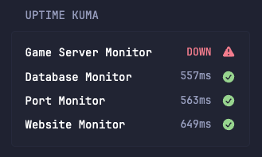

# Uptime Kuma



## Configuration
```yaml
- type: dynawidgets
  widget: uptime-kuma
  title: Uptime Kuma
  title-url: ${UPTIME_KUMA_URL}
  cache: 10m
```

## Environment variables

- `UPTIME_KUMA_URL`: The url of your Uptime Kuma instace (no slash on the end). For example, `http://my.uptime-kuma.instance`
- `UPTIME_KUMA_STATUS_SLUG`: The slug of your uptime kuma status page. For example, if your status page url is `http://my.uptime-kuma.instance/status/example` this variable would be set to `example`.
